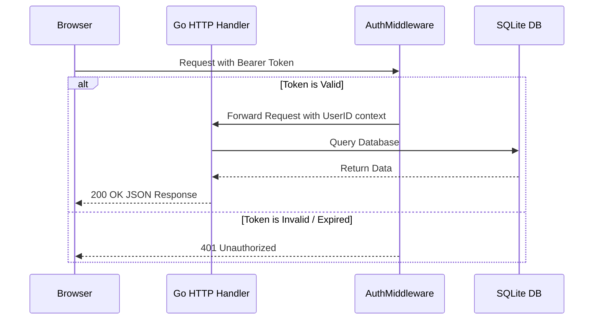
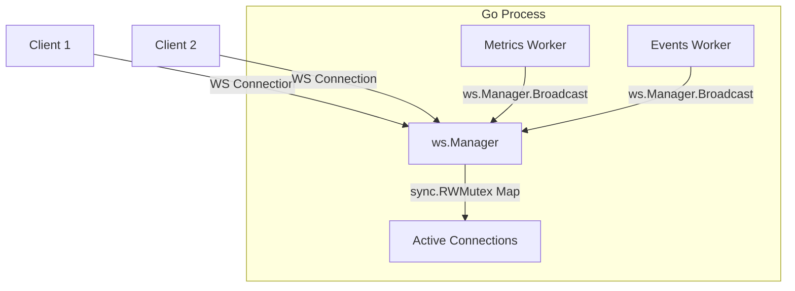

# QuickPulse Architecture Migration & Improvement: From Python to Go

## Executive Summary
QuickPulse is a self-hosted control panel designed for lightweight Docker and VPS monitoring. Because its primary purpose is monitoring, it must not consume resources that could otherwise run applications. 

The original tech stack was built using a **Python 3.12 (FastAPI, Uvicorn, SQLAlchemy)** backend, backed by **PostgreSQL/TimescaleDB** for metric storage, **Redis** for WebSocket pub/sub message routing, and **Nginx** to serve the static frontend assets. This multi-container architecture, while robust, carried high memory and CPU overhead.

To achieve maximum performance with a minimum VPS footprint, the stack was migrated to a consolidated **Go (Go 1.25)** backend engine, backed by an embedded **SQLite** database, an in-process thread-safe WebSockets pub/sub hub, and static assets embedded directly into the Go binary.

---

## 1. Before vs. After: Architecture Comparison

### The Legacy Stack (Python/FastAPI)
The legacy architecture required four active container services running on a Docker bridge network:
1. **Nginx container**: Served SvelteKit static files and proxied API requests.
2. **FastAPI backend container**: Python interpreter executing FastAPI routes and background tasks.
3. **TimescaleDB container**: Managed database files with high memory requirements.
4. **Redis container**: Handled pub/sub messages for WebSockets and session storage.

### The Unified Stack (Go Engine)
The migrated architecture consolidates all components into a **single, lightweight Go container**:
- **HTTP Routing & Static Assets**: Go serves the SvelteKit frontend (compiled and embedded via `go:embed`) and coordinates standard REST routes.
- **Database**: Embedded SQLite runs in WAL mode with connection limits optimized for concurrent reads.
- **Pub/Sub Broker**: Thread-safe memory channels (`sync.RWMutex`) handle WebSocket routing inside the Go process.

```mermaid
graph TD
    subgraph Legacy Architecture (4 Containers, ~1.4GB RAM)
        NGINX[Nginx Container] -->|Static Assets| BrowserLegacy(Web Browser)
        NGINX -->|Proxy HTTP/WS| FastAPI[FastAPI Backend Container]
        FastAPI -->|ORM/SQL| Timescale[TimescaleDB Container]
        FastAPI -->|Pub/Sub / Session| Redis[Redis Container]
    end

    subgraph Migrated Architecture (1 Container, ~15MB RAM)
        QPApp[qp-app Container]
        subgraph Inside qp-app Container
            GoBin[Compiled Go Binary]
            GoBin -->|go:embed| StaticAssets[Embedded Frontend Build]
            GoBin -->|In-Memory Map| PubSubHub[Go Pub/Sub Hub]
            GoBin -->|SQLite Driver| SQLite[Embedded SQLite DB]
        end
        QPApp -->|HTTP/WS on Port 80| BrowserMigrated(Web Browser)
    end
```

---

## 2. Resource Optimization Gains

| Metric | Legacy Stack (FastAPI, Postgres, Redis, Nginx) | Go Consolidated Stack (qp-app) | Optimization Gain |
| :--- | :--- | :--- | :--- |
| **Number of Containers** | 4 | **1** | **-75%** |
| **Idle Memory Usage** | ~600MB - 1GB | **~15MB** | **98%+ reduction** |
| **Idle CPU Usage** | ~2% - 5% | **0.00%** | **~100% reduction** |
| **Docker Image Size** | ~1.2 GB | **~35MB** | **97% reduction** |
| **Deployment Footprint** | Complex (multiple ports & volume mapping) | Simple (single port, single volume) | High reliability, low cost |

---

## 3. Tech Stack Conversion: Step-by-Step

### Step 1: Backend Routing & Middleware
- **Python**: Used `FastAPI` APIRouter with Pydantic models for validation and `uvicorn` as the ASGI application server.
- **Go**: Uses standard library `http.NewServeMux` (leveraging the Go 1.22+ enhanced pattern matching). Handlers read JSON payloads using a custom helper (`ParseJSON`) and output JSON response bodies using (`WriteJSON`).
- **Security**: The custom JWT authentication middleware translates Python's `python-jose` and `passlib` crypt libraries into native Go routines:
  - Generates tokens using `github.com/golang-jwt/jwt/v5`.
  - Hashes passwords using `golang.org/x/crypto/bcrypt`.
  - Validates endpoints via custom `AuthMiddleware` checking JWT claims and setting the contextual `UserIDKey`.



### Step 2: Database Migration
- **Python**: TimescaleDB hosted time-series metrics. Migrations were handled by `alembic` and models defined using `SQLAlchemy`.
- **Go**: Transitioned to an embedded SQLite database using `modernc.org/sqlite` (a pure-Go CGO-free driver).
- **SQLite Performance Tuning**:
  - Activated Write-Ahead Logging (`PRAGMA journal_mode=WAL`) to allow concurrent reads and writes.
  - Set `DB.SetMaxOpenConns(1)` and `DB.SetMaxIdleConns(1)` to serialise writes and prevent database locking issues (`database is locked` error).
  - Migrations are run programmatically on application startup via `createTables()` inside `db/db.go`. If no tables exist, they are generated immediately. Default administrator user details are seeded sequentially (`seedAdmin()`).

### Step 3: Real-Time Metrics & Events Collection
- **Python**: A background loop handled metrics polling utilizing `psutil` and Docker daemon updates utilizing `aiodocker`, publishing events to Redis.
- **Go**: Background workers run as concurrent goroutines starting from `main.go`:
  - `workers.StartMetricsWorker()` collects CPU, Memory, Disk, Net, Load, and Processes every 10 seconds using `github.com/shirou/gopsutil/v3`.
  - Metrics are immediately evaluated against user-configured alert thresholds inside `evaluateAlertRules` and saved into the `host_metrics` SQLite table.
  - Events are broadcasted directly to active WebSockets.

### Step 4: WebSockets & Pub/Sub Hub
- **Python**: Utilized Redis Pub/Sub backend to broadcast messages to WebSocket instances.
- **Go**: Implemented an in-memory, thread-safe WebSocket pub/sub hub inside the Go process (`ws/manager.go`):
  - Declares `WebSocketManager` with a read-write lock (`sync.RWMutex`).
  - Maintains `connections map[string]map[*websocket.Conn]bool`, mapping channels (`metrics`, `events`, `container-status`, logs) to connection references.
  - `Broadcast()` loops over connection pointers concurrently. Inactive connections are safely terminated and removed.



### Step 5: Frontend Hosting Consolidation
- **Python**: SvelteKit was compiled into static assets and served via Nginx.
- **Go**: Leverages Go's native embedding:
  - `//go:embed all:frontend/build` embeds SvelteKit build files into the binary.
  - Serves static assets using `http.FileServer(http.FS(fSys))`.
  - Fallback logic checks if the requested path matches an embedded file. If not, it falls back to serving `index.html` directly, delegating client-side routing to the SPA router (SvelteKit static site routing).

---

## 4. Multi-Stage Docker Build Strategy

To combine the frontend SvelteKit app and the Go backend into a single container while maintaining a minimal container image, a **three-stage Docker build** is used:

### Dockerfile Build Workflow

1. **Stage 1: Frontend Builder (`node:20-slim`)**
   - Installs dependencies (`npm ci`).
   - Compiles SvelteKit app into static build files (`npm run build`).

2. **Stage 2: Backend Builder (`golang:1.26-alpine`)**
   - Installs git, gcc, and libraries required to download dependencies.
   - Copies Go module files (`go.mod`, `go.sum`) and triggers module pre-download.
   - Copies pre-built static assets from Stage 1 into the `backend/frontend/build` folder.
   - Compiles the backend into a statically linked Go binary:
     ```bash
     CGO_ENABLED=0 GOOS=linux go build -ldflags="-w -s" -o qp-backend main.go
     ```
     *(CGO is disabled, making it compatible with a scratch or minimal alpine container, and `-ldflags="-w -s"` strips debug symbols to minimize file size to ~35MB).*

3. **Stage 3: Runtime Container (`alpine:3.19`)**
   - A bare minimal Alpine image.
   - Installs `curl` (for healthchecks) and CA certificates.
   - Copies the compiled `qp-backend` binary.
   - Exposes port `8000`.
   - Starts the application, automatically initializing the SQLite database at `/app/data/quickpulse.db`.

```mermaid
graph TD
    subgraph Stage 1: node:20-slim
        FSource[Frontend Code] -->|npm run build| FBuild[Svelte Static Assets]
    end

    subgraph Stage 2: golang:1.26-alpine
        BSource[Go Code] -->|Compile| GoComp[Go Compiler]
        FBuild -->|Copy to backend/frontend/build| GoComp
        GoComp -->|CGO_ENABLED=0| GoBin[qp-backend Statically Linked Binary]
    end

    subgraph Stage 3: alpine:3.19 (Runtime)
        GoBin -->|Copy to app/| RunBin[qp-backend]
        RunBin -->|Start Server| Server[HTTP Server Port 8000]
    end
```

---

## 5. Other Architectural Enhancements & Features

### A. Automatic Kubernetes Live Integration
- **Direct client connection**: Instead of running a heavy proxy, the backend imports `k8s.io/client-go` and directly communicates with the cluster defined in the host's `.kube/config` (mounted in the container).
- **Fallback safety**: If the cluster is unreachable or no kubeconfig exists, the API handlers automatically switch to serving high-quality mock data, preventing backend crashes.
- **WebSocket Streaming Logs**: Handlers like `HandleWSK8sLogs` read from the Kubernetes API pod log streams and pipe updates directly to WebSocket channels.

### B. Simplify Stacks Status Check
- Go structs (like `StackResponse` in models) were aligned with the frontend Svelte structures by introducing `Running` and `Total` properties. This resolved stack listing issues and simplified display logic compared to Python's dictionary mappings.

### C. Developer-First Configuration
- Environment settings are loaded via simple `os.Getenv` lookups in Go, eliminating the complex Pydantic `BaseSettings` cache/parsing loops and speeding up bootstrap times.
- Development requires just Go and Node.js installed locally, running independently of heavy infrastructure components.
